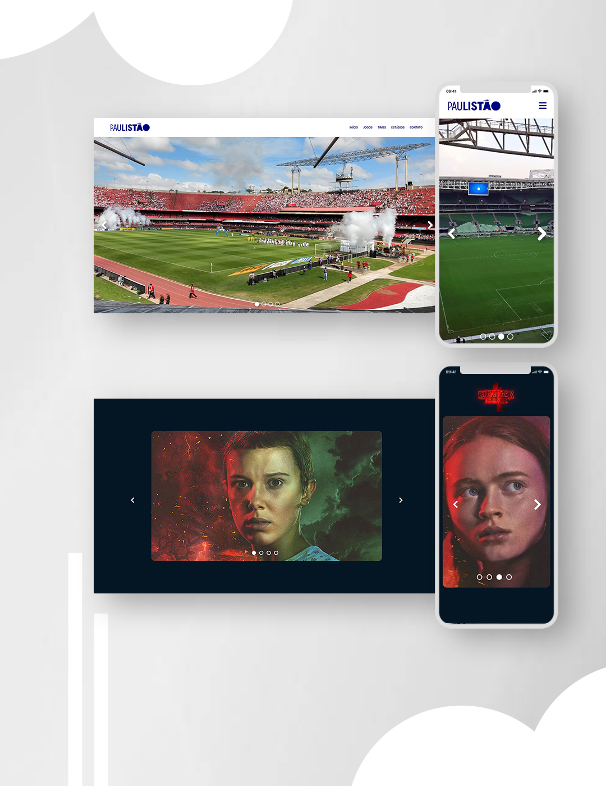

<h1>Slider (Carrosel)</h1>

<h3>
  Projetos desenvolvidos para estudo
</h3>
 

 <!-- <a href="#visao">• Visão geral</a>   -->
 <a href="#leng">• Skills utilizadas</a>
  
 <a href="#contato">• Contato</a>  

 

<h1>Visão geral</h1>
Slier (Carrosel) de imagens <strong>utilizado em muitos sites da web</strong>, principalmente em e-commerce, onde é possível passar para a próxima imagem ou para a anterior, clicando nos <strong>botões de setas</strong> ou através das <strong>bolinhas</strong> que indicam qual imagem do slide está sendo exibida.
No <strong>modelo 1</strong> foi criado no formato comum visto em sites, já no <strong>modelo 2</strong>, foi criado em formato de uma galeria de fotos. Também foi trabalhado <strong>responsividade</strong> em ambos os sliders. É possível testaros dois modelos clicando nos links abaixo.

 
 

<h1 align="center">
<!-- <h1> -->
<a href="https://htmlpreview.github.io/?https://github.com/matealves/slider/blob/main/slider-site/index.html" target="_blank">Testar - slider site</a> 
 
 
<a href="slider-gallery/index.html" target="_blank">Testar - slider gallery</a> 
</h1>

  

 

<h1>Skills utilizadas</h1>

 
  
  

 
 
 

<h1>Como entro em contato?</h1>

Entre em contato através dos links a seguir!
 
 

 
 
 
